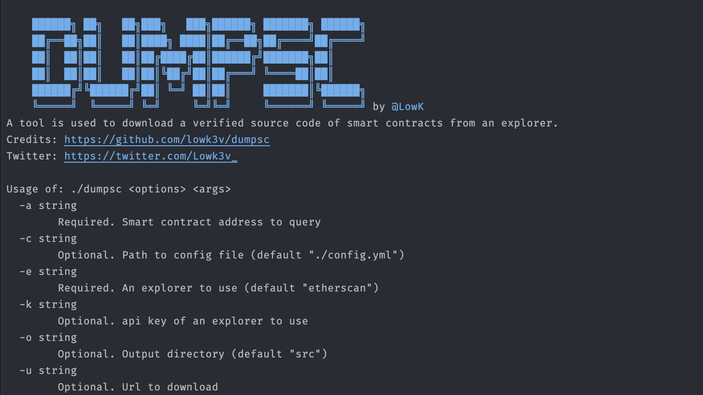

# dumpsc


`dumpsc` is a tool used to download a verified source code for smart contracts from an explorer (without a key).

# Features

Download verified source code from an explorer

# Usage 



# Installation

```sh
go install github.com/lowk3v/dumpsc@latest
```

# Todo 
- [X] List supported explorers
- [X] Add more explorers
- [x] Show version of binary
- [ ] Add more tests
- [ ] Support input from stdin
- [ ] Support output to stdout

# Donate

Cryptocurrency ETH
```
0x1337b23C637B3b802A9a0a57761c02026f614e6b
```

<a href="https://www.buymeacoffee.com/lowk"></a>

# License
MIT License
